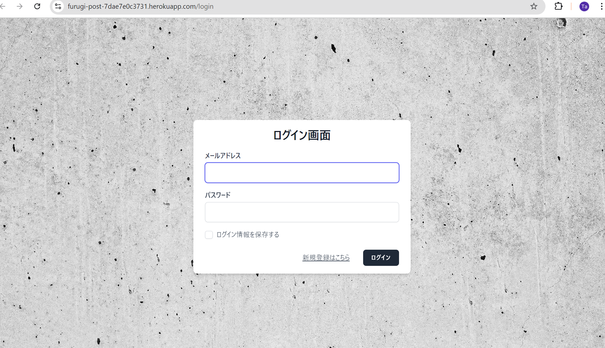
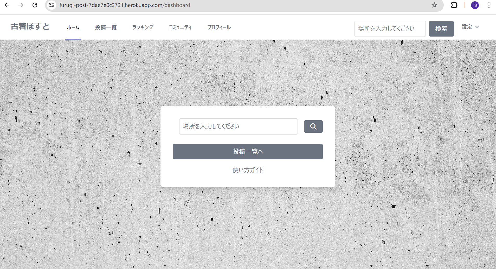
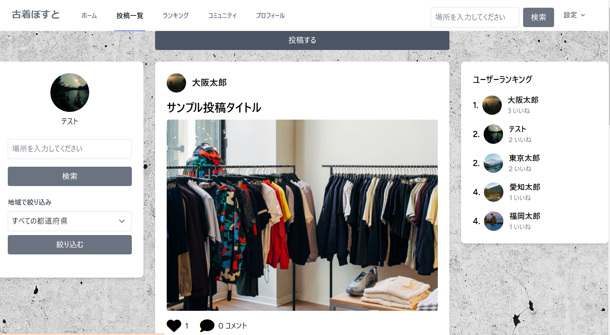
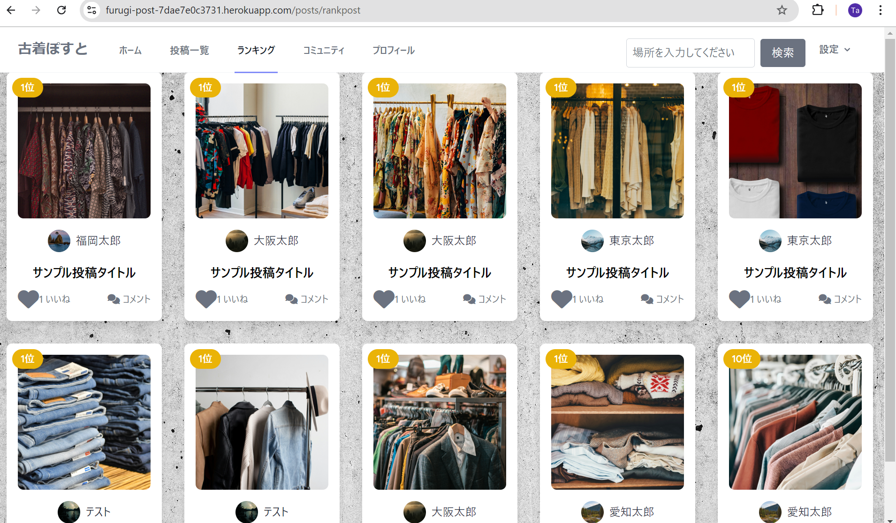
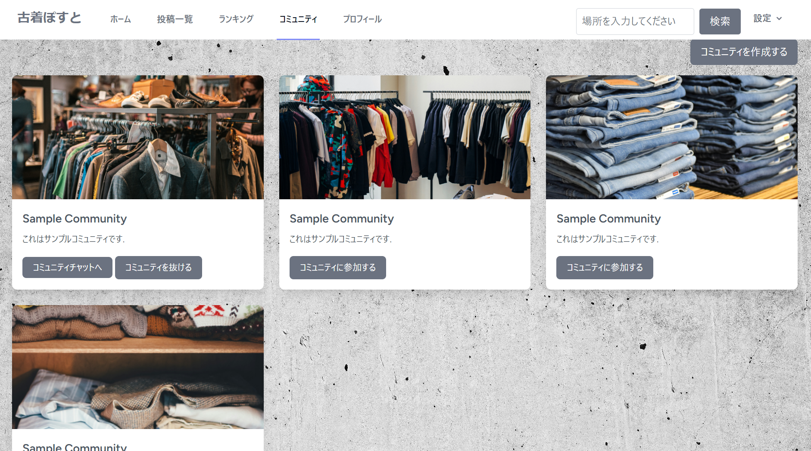
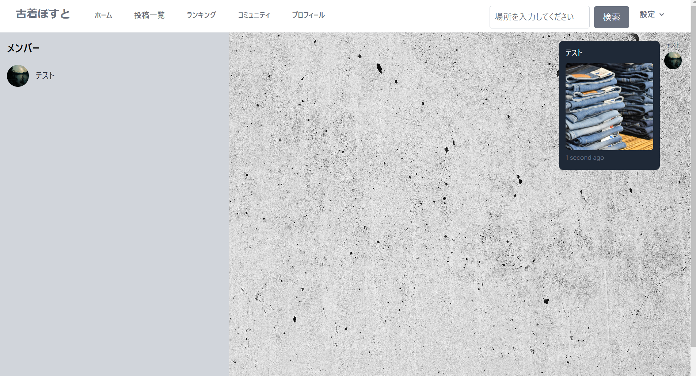
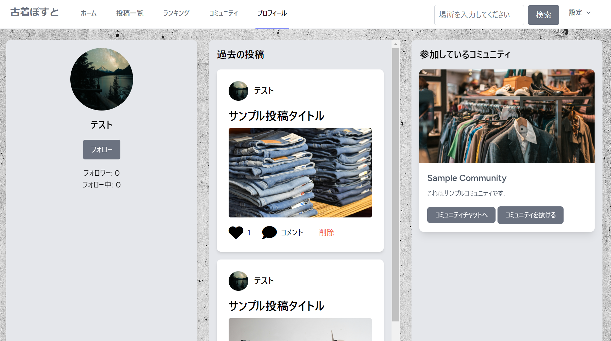
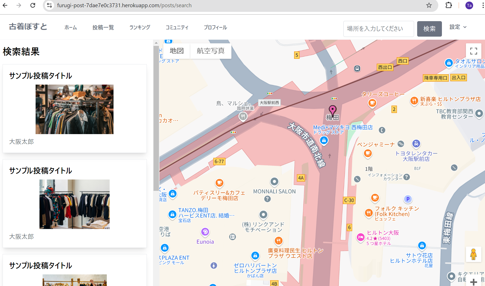
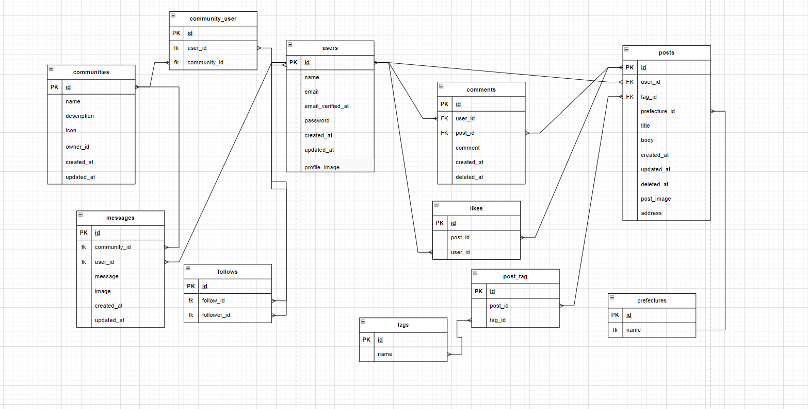

# アプリ名
**古着ぽすと**

## 概要
古着ぽすとは、古着好きのユーザーが自分のお気に入りの古着や、おすすめの古着屋を投稿・共有できる古着投稿アプリケーションです。投稿された古着屋情報を他のユーザーが閲覧し、好みの古着屋を見つけることができます。

## 作成背景
私は古着が好きで、古着屋巡りをよく行います。しかし、古着屋はそれぞれ個性があり、自分の趣味に合った古着屋を見つけるのは難しいことが多いです。また、インターネット上ではお客様目線の古着屋情報が少ない現状です。そこで、古着好きの人々が簡単に情報を投稿・共有できるアプリを開発しました。このアプリは、古着屋探しをより簡単にし、古着好き同士のコミュニケーションの場を提供します。

## 使用技術

  
  
  
  
  
  
  
  

## URL・テストユーザー
- URL: **[https://furugi-post-7dae7e0c3731.herokuapp.com/]**
- テストユーザー:
  - ログイン名: テスト
  - ログインID（メールアドレス）: **[test@example.com]**
  - パスワード: **[password]**

## 機能
- **投稿機能**: 古着やおすすめの古着屋情報を投稿できる
- **ランキング機能**: いいね数に基づく投稿ランキング・ユーザーランキング
- **コミュニティ機能**: 趣味の合うユーザー同士が交流できる。また、コミュニティでグループチャットが可能
- **地図検索機能**: 住所で古着屋を検索し、地図上で投稿の場所を確認できる
- **都道府県フィルタ機能**: 投稿一覧画面で都道府県による絞り込みが可能
- **フォロー機能**: ユーザーのフォローが可能。また、それぞれのユーザーのフォロー数、フォロワー数の閲覧が可能
- **ログイン機能**: Laravel breezeを用いてログイン機能を実装

## デモ

アプリの動作デモを以下に示します。

### ログイン画面

### ホーム画面

### 投稿一覧

### ランキング画面

### コミュニティ画面

### チャット画面

### プロフィール画面

### 検索結果画面

## 工夫点
- 誰もが使いやすいシンプルなレイアウトで、ホーム画面にはアプリの使い方ガイドを表示
- 投稿ランキングとユーザーランキングを実装し、ユーザーの投稿意欲を高める工夫
- コミュニティ機能の実装により、趣味が合うユーザー同士の交流を促進
- 地図検索機能の実装により、投稿された古着屋情報を視覚的に確認可能
- 都道府県による絞り込み検索機能の実装

## 苦労した点
- Laravel breezeにデフォルトで使用されているレイアウトの変更
- Google Map APIの使用
- ランキング機能での同率順位の考慮

## 今後の展望
- **新機能の追加**: 個人チャット機能の追加
- **スマートフォン対応**: モバイルフレンドリーなデザインへの最適化

## ER図
### ER図です

